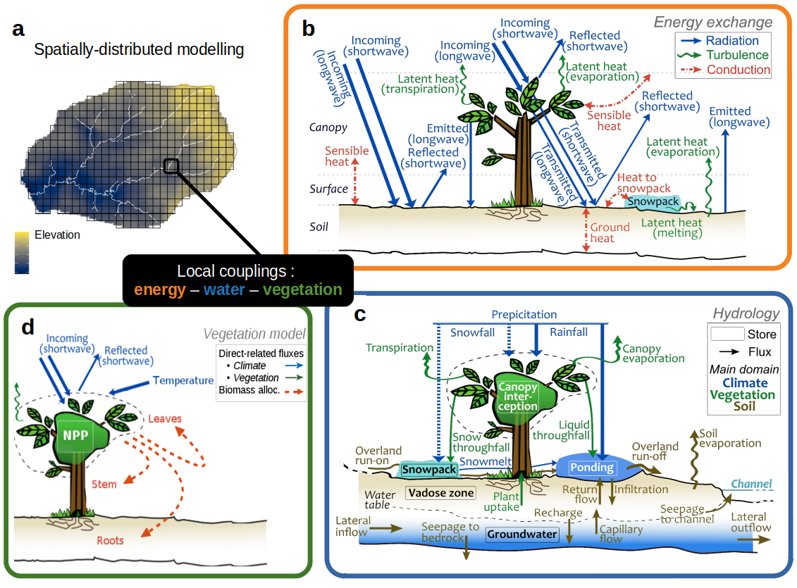
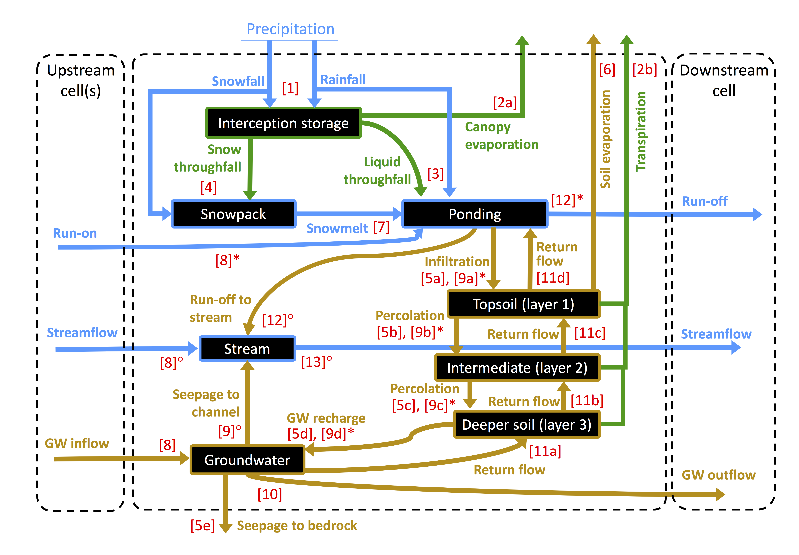

.. |ech2o| replace:: EcH\ :sub:`2`\ O

|ech2o|-iso
===============

|ech2o|-iso builds on the **process-based, spatially distributed ecohydrologic model EcH**\ :sub:`2`\ **O** developed in C++ in the Regional Hydrology Lab at the University of Montana (Maneta & Silverman, 2013) (`link <http://hs.umt.edu/RegionalHydrologyLab/software/default.php>`_).
The general structure of the model is given in Fig. 1.

   **Figure 1.** Conceptual diagram of the structure of the |ech2o| model. The grid cells of the simulation domain (a) are laterally connected via overland runoff, streamflow and lateral flow in the saturated profile (DEM-derived drainage network), with for each grid cell a process-oriented description of (b) the energy balance, (c) hydrological transfers and (d) vegetation growth and dynamics. Adapted from Kuppel et al. (2018a) and Douinot et al. (2019).

The specifity of |ech2o|-iso is the implementation of stable water isotopes (:sup:`2`\ H and :sup:`18`\ O) and age tracking.
It is mostly based on an immediate, complete implicit scheme for mixing water transiting between compartments within time steps (Fig. 2).
Evaporative fractionation of isotopes is also included.

   **Figure 2.** Water compartments (black rectangles) and fluxes (coloured arrows) as represented in |ech2o| and used for isotope and age tracking in |ech2o|-iso, with the numbers between brackets reflecting the sequence of calculation within a time step. Note that water routing (steps [8] to [13]) differs between cells where a stream is present (◦) or not (∗). 

   
Latest Version
**************

The latest stable version can be found in the *master_2.0* branch of the `source repository <https://bitbucket.org/sylka/master_2.0/>`_. 

**Documentation**

The documentation for installing an runnnig |ech2o|-iso, available as of the date of this release, can be found on its `ReadTheDocs webpage <http://ech2o-iso.readthedocs.io/en/latest/>`_.

**Third-party dependencies**

|ech2o|-iso depends on the following third-party libraries with the following licenses:
  
- armadillo (Mozilla Public License 2.0) and dependencies therein 
- libcsf (BSD License)
  
For convenience, precompiled versions of the libcsf librairies for Linux, Windows 64 bit, and Mac architectures are distributed with the source code.   

**Compilation of source code**

Please see the fille called INSTALL.rst

**Data Preprocessing**

|ech2o|-iso uses the PCRASTER map format (a cross-system format) for data pre- and post-processing, and for visulalization. 
PCRASTER can be downloaded free of charge from http://pcraster.geo.uu.nl/downloads

**Licensing**

Please see the file called LICENSE.txt.

**Bugs**

Should you encounter any bug, please file a ticket `here <https://bitbucket.org/sylka/ech2o_iso/issues>`_.
Known issues can be found there, as well as on the `main EcH2O page <https://bitbucket.org/maneta/ech2o/issues>`_.

**How to Cite**

Please, acknowledge the use of |ech2o|-iso by citing:

- Kuppel, S, Tetzlaff, D, Maneta, MP & Soulsby, C (2018). |ech2o|-iso 1.0: Water isotopes and age tracking in a process-based, distributed ecohydrological model, Geosci. Model Dev., 11, 3045-3069, `<https://doi.org/10.5194/gmd-11-3045-2018>`_.
  
Further references documenting previous/specific developments and/or application of the code:

- Douinot A et al. (2019). Ecohydrological modelling with EcH2O-iso to quantify forest and grassland effects on water partitioning and flux ages. Hydrological Processes 33 (16): 2174–2191, `<https://doi.org/10.1002/hyp.13480>`_.
- Knighton, J et al. (2020). Using isotopes to incorporate tree water storage and mixing dynamics into a distributed ecohydrologic modelling framework. Ecohydrology, 13(3), e2201 `<https://doi.org/10.1002/eco.2201>`_.
- Kuppel, S et al. (2018). What can we learn from multi-data calibration of a process-based ecohydrological model?. Environmental Modelling & Software, 101, 301–316, `<https://doi.org/10.1016/j.envsoft.2018.01.001>`_.
- Kuppel, S et al. (2020). Critical zone storage controls on the water ages of ecohydrological outputs. Geophysical Research Letters, 47, e2020GL088897 `<https://doi.org/10.1029/2020GL088897>`_.
- Lozano-Parra, J, Maneta, MP & Schnabel, S (2014). Climate and topographic controls on simulated pasture production in a semiarid Mediterranean watershed with scattered tree cover. Hydrology and Earth System Sciences, 18, 1439, `<https://doi.org/10.5194/hess-18-1439-2014>`_.
- Maneta, MP & Silverman, N (2013). A spatially-distributed model to simulate water, energy and vegetation dynamics using information from regional climate models. Earth Interactions, 17, 1-44, `<https://doi.org/10.1175/2012EI000472.1>`_.
- Maneta, MP et al. (2018). Conceptualizing catchment storage dynamics and nonlinearities. Hydrological Processes, 32, 3299–3303, `<https://doi.org/10.1002/hyp.13262>`_.
- Neill, AJ et al. (2020). An agent-based model that simulates the spatio-temporal dynamics of sources and transfer mechanisms contributing faecal indicator organisms to streams. Part 1: Background and model description. Journal of environmental management, 270, 110903 `<https://doi.org/10.1016/j.jenvman.2020.110903>`_.
- Neill, AJ et al. (2020). An agent-based model that simulates the spatio-temporal dynamics of sources and transfer mechanisms contributing faecal indicator organisms to streams. Part 2: Application to a small agricultural catchment. Journal of environmental management, 270, 110905 `<https://doi.org/10.1016/j.jenvman.2020.110905>`_.
- Simeone, C et al. (2019). Coupled ecohydrology and plant hydraulics modeling predicts ponderosa pine seedling mortality and lower treeline in the US Northern Rocky Mountains. New Phytologist, 221(4), 1814-1830, `<https://doi.org/10.1111/nph.15499>`_.
- Smith A et al. (2019). Assessing the influence of soil freeze–thaw cycles on catchment water storage–flux–age interactions using a tracer-aided ecohydrological model. Hydrology and Earth System Sciences 23 (8): 3319–3334, `<https://doi.org/10.5194/hess-23-3319-2019>`_.
- Smith, A et al. (2020). Isotope‐aided modelling of ecohydrologic fluxes and water ages under mixed land use in central Europe: the 2018 drought and its recovery. Hydrological Processes, 34(16), 3406-3425 `< https://doi.org/10.1002/hyp.13838>`_.

**Contacts**

If you have any questions, please contact sylvain.kuppel@inrae.fr or marco.maneta@umontana.edu.
